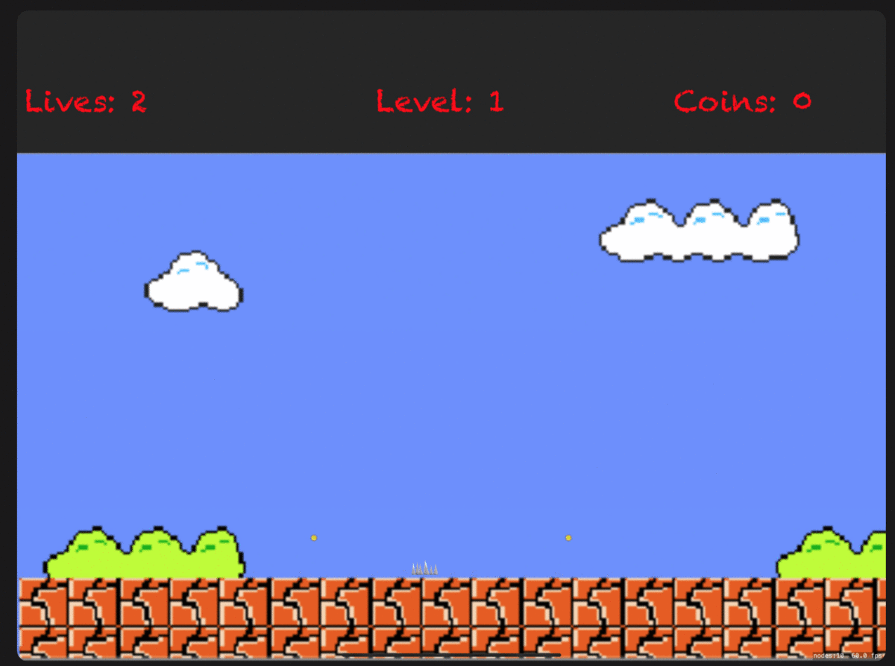
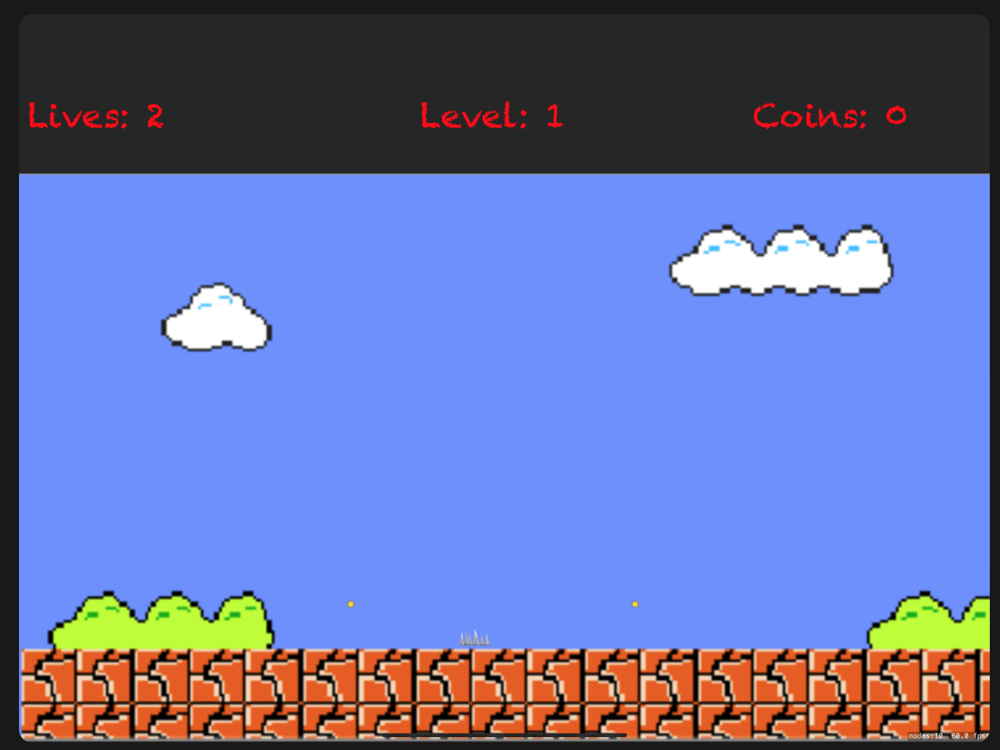
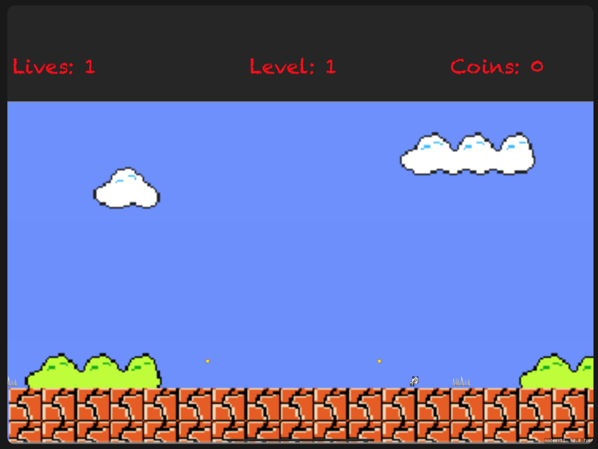
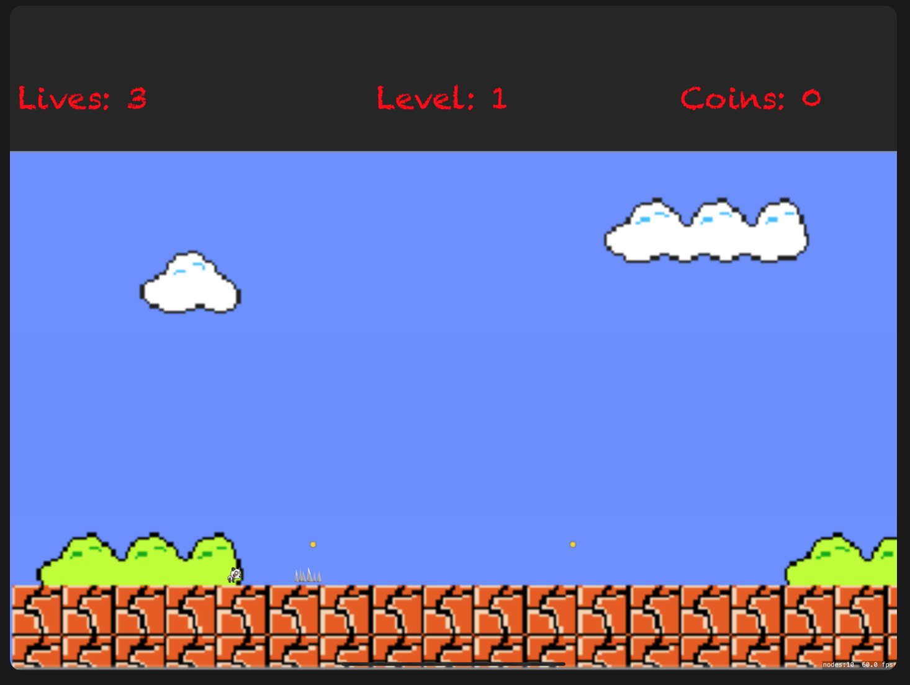
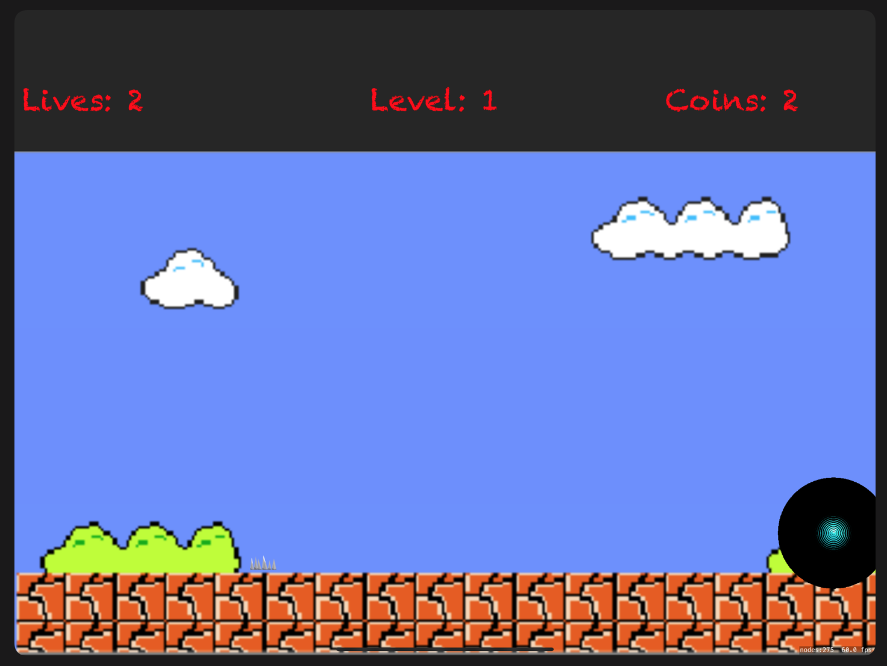
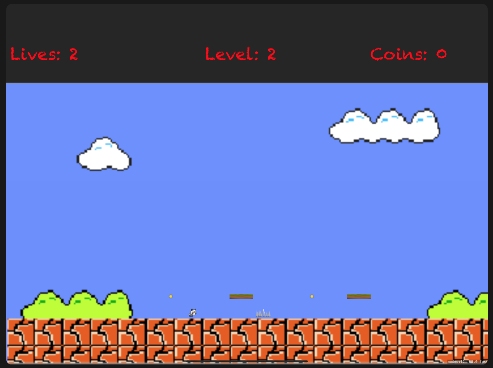

# PandaGame
This is Game designed for course 5244 MADT in Lambton College for Class Test on june 16.

# Instruction
Please Run the game in Landscape Mode on iPad Pro (12.9-inch)(4th Generation) simulator

# Challenges Done
- Two levels
- Panda Start at lower left in both levels
- Panda Have 3 Lives
- Panda automatically moves left and right, forever
- Panda can jump
- Panda Touches Spike Lose a Live
- Panda Lose all 3 lives Game Over and Lose
- Panda can Collect Coins
- After collecting all coins, show an Exit Portal
- When panda touches an exit, switch to next level
- Detects when game is over & YOU LOSE screen is shown
- Detect when the player wins & YOU WIN screen.
- Plays Background sound, hit enemy sound, win or lose game sound , jump sound

# Screenshots:
 
 
 
 

 
 
 
 
 
 
 
